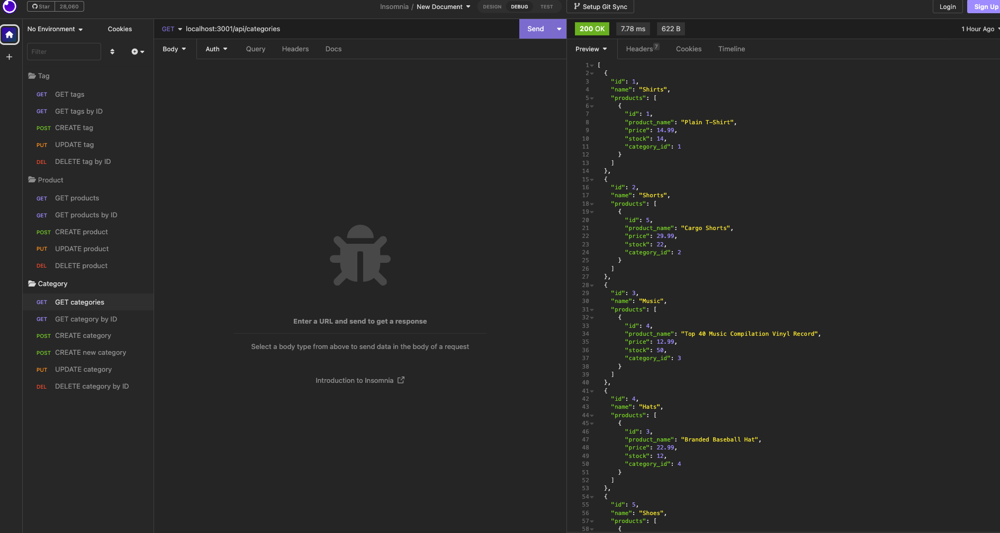

# E-Commerce Back End

## Table of Contents

- [Description of the Project](#description)
- [Installation](#installation)
- [Screenshot](#screenshot)
- [Links](#links)
- [License](#license)

## Description

This is a back end for an e-commerce site by modifying starter code. It has a working Express.js API to use Sequelize to interact with a MySQL database. You will need to add your database name, MySQL username, and MySQL password to an environment variable file to be able to connect to a database using Sequelize. Then you need to enter schema and seed commands to create and seed a development database.

## Installation

- Uses the MySQL2 package to connect to a MySQL database.
- Stores MySQL username, password, and database name, using the dotenv package.
- Use Sequelize package.

## Screenshot

## Links

- GitHub: https://github.com/Chenson92/E-Commerce-Back-End
- Walk Through Video: https://drive.google.com/file/d/105fz6Q67pXRKgDfgLStFeDta5c1w8WF0/view

## License

This project is licensed under the terms of the MIT license.
[License](https://opensource.org/licenses/MIT)
